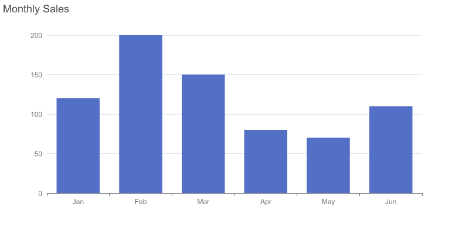
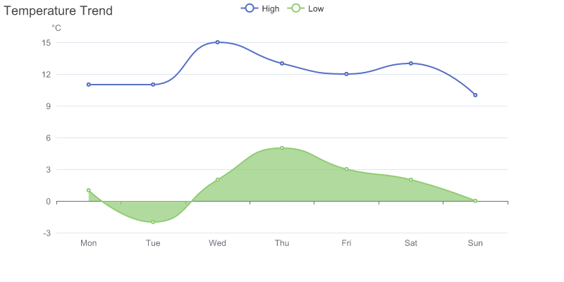
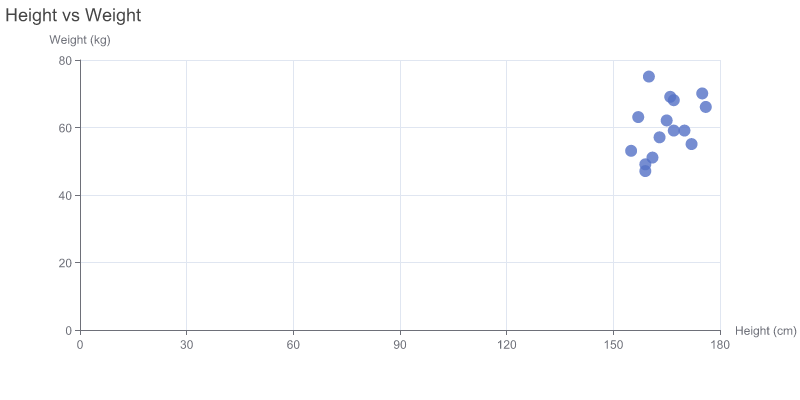
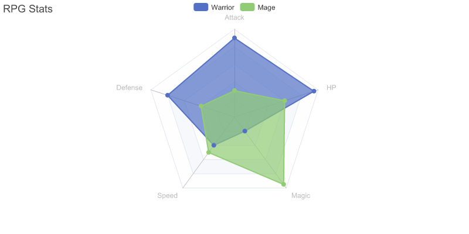
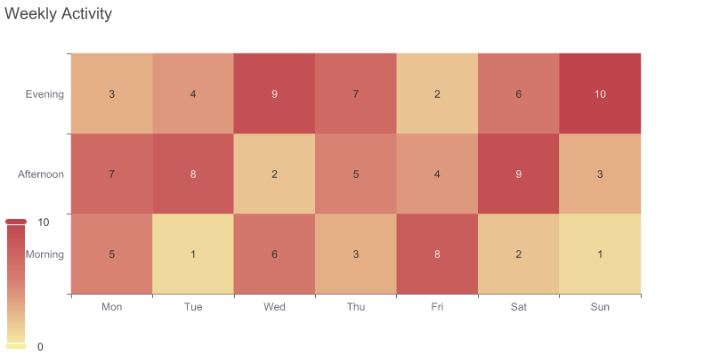
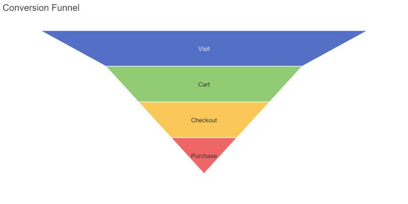
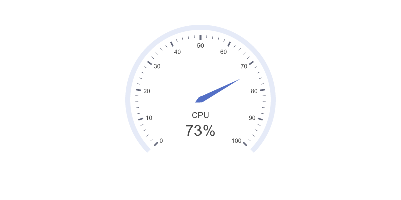
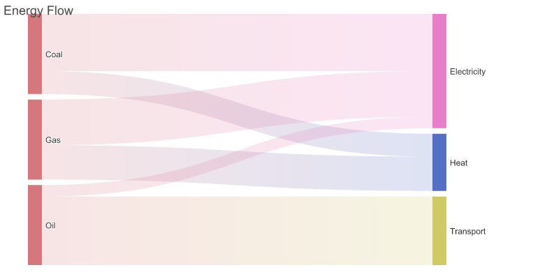
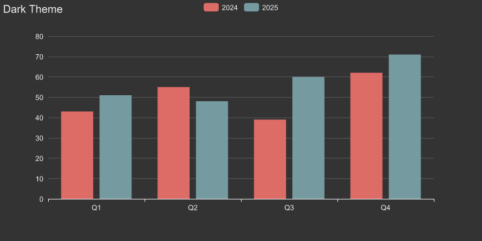

# charts-cli 📊

[](https://github.com/Michaelliv/charts-cli/actions/workflows/ci.yml) [](https://opensource.org/licenses/MIT)

**Chart generation CLI for agents.**

Feed it an [ECharts](https://echarts.apache.org/) JSON config, get back SVG or PNG. No browser, no GUI, no fuss.

---

## Examples

<p>
  
  
</p>
<p>
  
  
</p>
<p>
  
  
</p>
<p>
  
  
</p>
<p>
  
  
</p>

---

## For Humans

You install it. Your agent does the rest.

### Installation

```bash
npm install -g charts-cli
```

### Setup

```bash
# Teach your agent how to use charts
charts onboard
```

This adds instructions to your `CLAUDE.md` or `AGENTS.md` file. Done.

### Themes

Built-in themes: `dark`, `vintage`, or pass a path to a custom JSON theme file.

```bash
echo '{...}' | charts render --theme dark -o chart.png
```

---

## For Agents

### 1. Get the Schema

```bash
# What chart types are available?
charts schema --list

# Get the schema for what you need
charts schema bar
charts schema xAxis
charts schema tooltip
charts schema              # Full EChartsOption (top-level keys)
```

Available types:

- **Series**: bar, line, pie, scatter, radar, funnel, gauge, treemap, boxplot, heatmap, candlestick, sankey
- **Components**: title, tooltip, grid, xAxis, yAxis, legend, dataZoom, visualMap, toolbox, dataset, radar-coord, polar, geo

### 2. Render

```bash
# From stdin
echo '{
  "xAxis": { "type": "category", "data": ["Mon", "Tue", "Wed"] },
  "yAxis": { "type": "value" },
  "series": [{ "type": "bar", "data": [120, 200, 150] }]
}' | charts render -o chart.png

# From file
charts render --config option.json -o chart.svg
```

### Render Options

| Option | Description |
|--------|-------------|
| `--config <file>` | JSON file with ECharts option |
| `-o, --output <file>` | Output file (default: stdout) |
| `-W, --width <n>` | Width in pixels (default: 800) |
| `-H, --height <n>` | Height in pixels (default: 400) |
| `--theme <name>` | `dark`, `vintage`, or path to JSON theme |
| `--format <type>` | `svg` or `png` (auto-detected from extension) |

### Output

- No `-o` sends SVG to stdout (pipeable)
- `-o chart.svg` writes SVG
- `-o chart.png` or `--format png` writes PNG

---

## FAQ

**Q: Why not just have the agent write a Python script with matplotlib?**

Because that's a whole runtime, dependencies, and 50 lines of code for a bar chart. This is one pipe.

**Q: Why ECharts?**

30+ chart types, deep customization, great docs, and agents already know the config format from training data. The schema command fills in the gaps.

**Q: What if the agent generates invalid JSON?**

ECharts is forgiving. Missing fields get defaults. The agent gets the chart (maybe not perfect) and can iterate.

---

## Development

```bash
bun install
bun run src/main.ts --help

# Regenerate schemas from ECharts types
bun run generate:schema
```

---

## License

MIT
